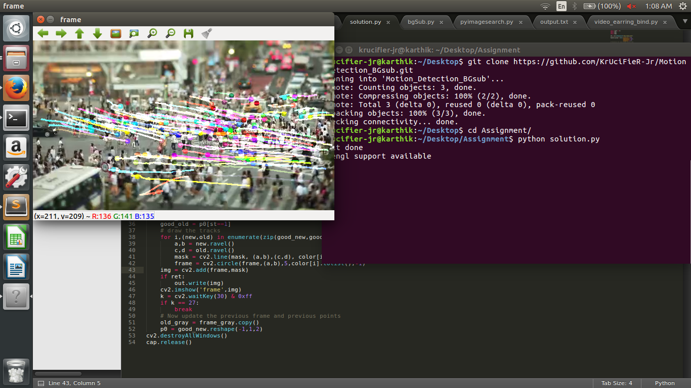
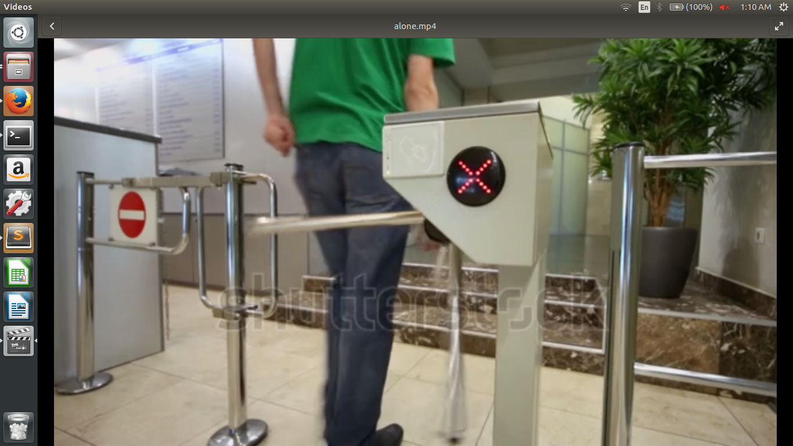
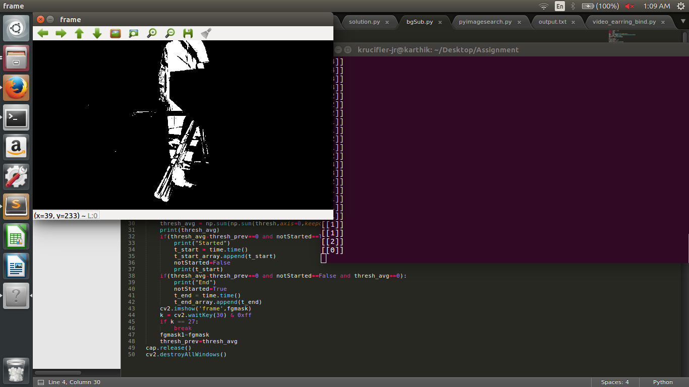
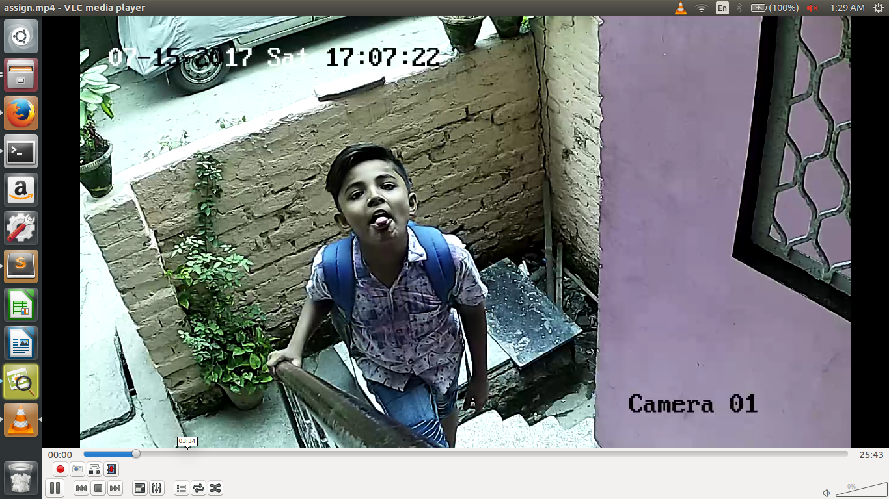

# Motion_Detection_BGsub

## Computer Vision Assignment

I intially took the assignment as problem for tracking people in the crowded space, read some research paper and applied Crowd Detection Analysis with help of optical flow.

Then after reading real problem statement and sample video which made me crystal clear on my attempt,thus I used BG subractor in order to compare the two consecutive frames and try to analysis the average threshold change by taking mean across the area of frame.

There are two types of output files created and All the information in the output text files are that of the video which was sent to me on mail(25 min).
I didn't record the output images as its pretty time consuming to wait for the correct moment.

1)output_real_time.txt:This was to take the readings on Real Time.

2)output.txt:This was based on number of frames.

I had fun working both on BG subractor as well as the Optical Flow Analysis.

## Interesting Part :

I watched the 25 min sample and the best part was 1min : 37sec when kid shows up !!

I had a pretty nostalgic experience with this kid!

 
The interesting part was that when the kid taunts the camera, then script doesn't record any changes as the previous frame is almost same as the current frame hence according the script it terminates the time for capture of moment but eventually when kid moves the again starts recording which was pretty interesting according to me as there is a discontinuity.

